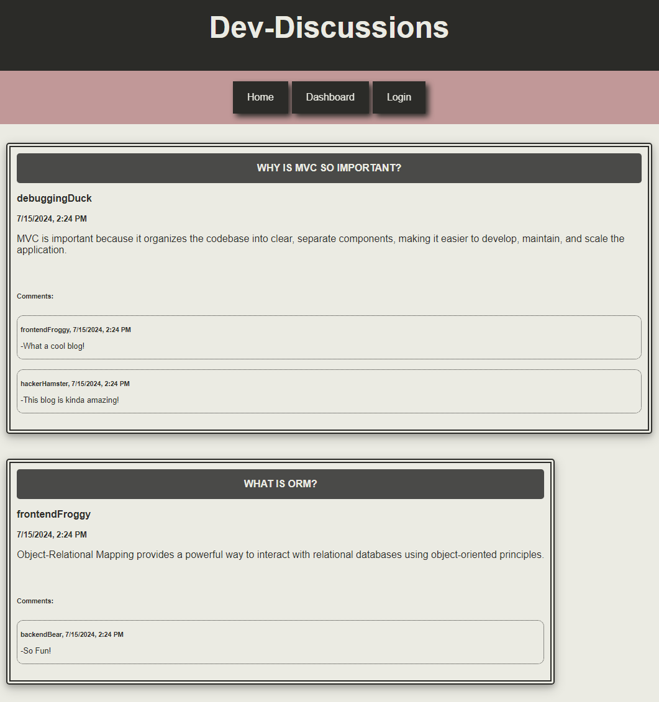

# Dev-Discussions

Dev Discussions is a CMS-style blog site designed for developers to publish blog posts, comment on other developers' posts, and engage with the community! 

- Users can sign up by creating a username and password, then login to access their account and logout when their done using the site.

- The homepage lets you browse through existing blog posts, showing titles and when they were created.

- In your dashboard, you can view all the posts you've written, as well as create, update, or delete them.

- Want to share a new post? Just click "Create New Post", enter a title and your content, and you're good to go! If you need to make changes or remove a post, you can do that too!

- You can read comments on any blog post to see what others are saying.

- Feel like joining the conversation? Leave a comment on a post when you're logged in.

- Easily get back to the homepage with a click. Access your personal dashboard to manage your posts and log out with a simple click when you're finished.

## Installation

To install Dev Discussions:

- Clone the repository: https://github.com/girlnotfound/Dev-Discussions

- Navigate to the project directory

- Open the terminal and install the dependencies by running the command: `npm install`

- Set up the PostgreSQL database:

  - Enter `psql -U postgres` to open the PostgreSQL command line interface. If prompted, input your password.
  - To set up the database, type `\i schema.sql` and press Enter.
  Now your database is ready to use!

- Remove '.EXAMPLE' from the .env.EXAMPLE file renaming it to .env

- Configure that .env file with your database credentials

- Seed data to your database. In the terminal run the command: `npm run seed`

## Usage

- Start the application, in the terminal run the command: `npm start`

## Credits

This project was made possible with the help of:

[Adam Rosenberg](https://github.com/AcoderRose)

[Ryan Petersen](https://github.com/RyanPetersen-89)